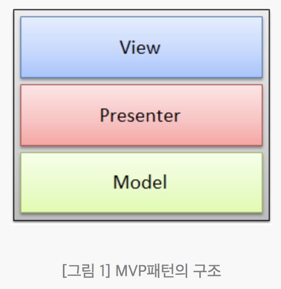
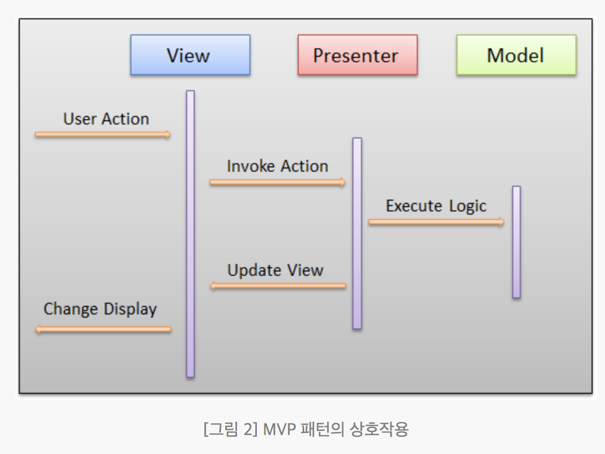
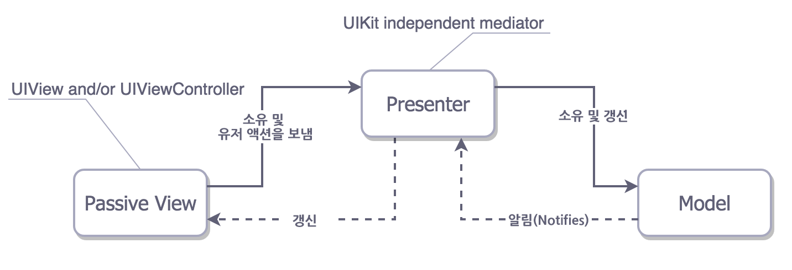
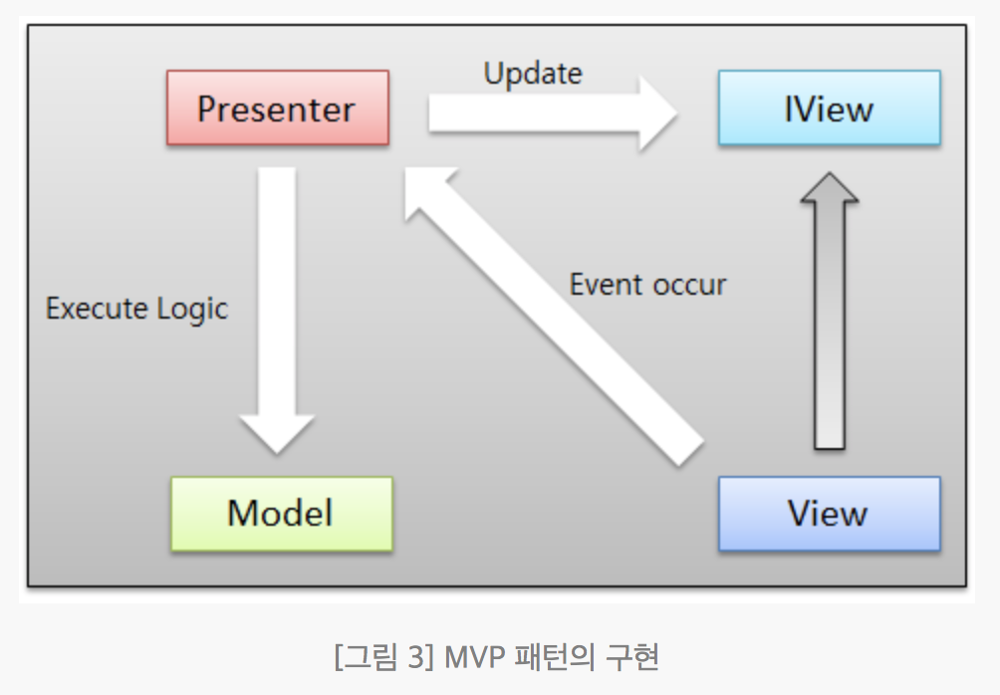
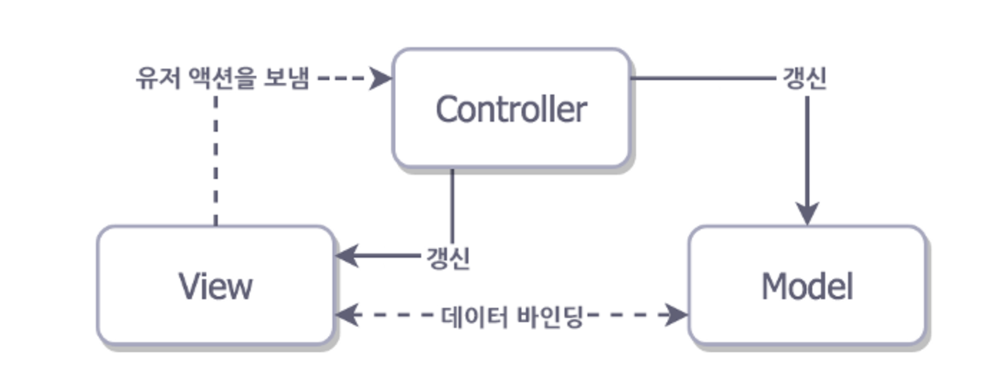

# MVP 패턴
- MVC형태에서 View와 Model 간의 커플링을 줄이는 것을 목표로함 

## View
- 콘텐츠를 사용자에게 표시
- 사용자의 행동에 따른 이벤트를 Presenter에게 전달하는 역할

## Presenter
- 사용자 이벤트에 대한 조작의 처리와 Model을 다루고 상태변화를 View에게 알리는 역할
- Presenter에는 레이아웃 관련 코드가 없고 오직 View의 데이터와 상태를 갱신하는 역할만 가진다.

## Model
- 비지니스로직의 처리
- Application Data를 다룸

[그림출처: http://steveyoon.tistory.com/188](http://steveyoon.tistory.com/188)

## 과정
1. 입력이 View에서 처리됨
2. Presenter은 View와 Model의 instance를 가지고 있음 ( View와 Model 사이의 다리역할을 함)
3. View 에서 이벤트 발생시 Presenter에게 전달
4. Presenter은 해당 이벤트에 따른 Model을 조작하고 그 결과를 Binding을 통해 View에게 통보하여 View를 업데이트

## MVP의 특징
- Distribution : Presenter 과 Model의 책임을 거의 분리했고 View는 빈껍데기가 됨.
- Testability : View의 재사용가능 덕분에 대부분의 비지니스 로직을 테스트 할 수 있다.
- Easy of Use : MVC에 비해 코드의 양이 많지만 익숙하지 않은 개발자가 쉽게 관리 할 수 있음

## MVP의 장단점
- Presenter을 통해 Model과 View를 완벽하게 분리해주기 때문에 View는 Model을 따로 알고 있지 않아도 된다는 장점을 가지고 있다
- View와 1대 1의 관계이기 때문에 View와의 의존성이 매우 강함

## MVC와의 비교
- MVC의 경우 View는 사용자 동작에 대한 통신을 Controller와 수행하지만 변경에 대한 알림은 모델로 부터 받는다. 그리고 업데이트된 데이터를 가져오고 자체를 새로 고치기 위해 Model에 대한 세부적인 정보를 활용해야 한다. 이는 View와 Model 간의 커플링을 높이게 된다

## MVP 패턴의 구현
- MVP패턴을 구현하기 위해서는 다음과 같은 구조를 클래스와 인터페이스를 이용해야 한다.

## MVP의 다른 버전(MVP Supervising Controller)

- 이 다른 버전의 MVP는 Presenter(Supervising Controller)가 View를 바꾸고 View로부터 받은 액션을 핸들링 하는동안 View와 Model의 바인딩을 포함함